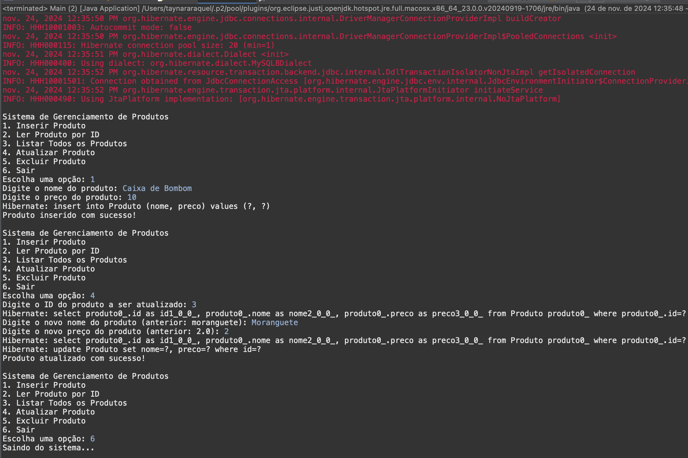
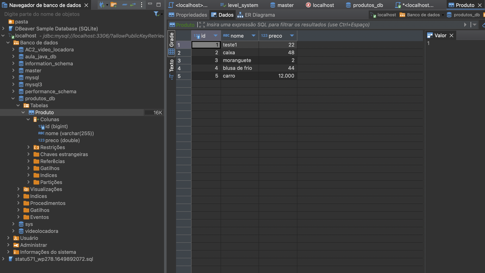

# Projeto: Sistema com JPA e MySQL utilizando WAMP






## 📋 Resumo
Este projeto implementa um exemplo prático de utilização do **Java Persistence API (JPA)** para manipulação de dados em um banco de dados MySQL. Foi configurado utilizando **DBeaver** e **localhost**, com um projeto Maven contendo todas as dependências necessárias.

## 🔧 Tecnologias Utilizadas
- **Linguagem**: Java
- **Framework**: JPA
- **Servidor de Banco de Dados**: MySQL (via WAMP Server ou equivalente)
- **Ferramentas**: Apache Maven, IDE como IntelliJ, Eclipse ou NetBeans

## 📋 Estrutura do Código
### Classe Principal
A classe principal `ProdutoManager` é responsável por gerenciar as operações básicas no banco de dados utilizando JPA.

### Componentes Principais
1. **Entidade Produto**: Classe mapeada para representar a tabela `produto` no banco de dados.
2. **Persistence Unit**: Configuração do `persistence.xml` para conectar ao banco de dados MySQL.
3. **Operações CRUD**:
   - **Create**: Adicionar novos produtos ao banco de dados.
   - **Read**: Listar os produtos armazenados.
   - **Update**: Atualizar informações de um produto existente.
   - **Delete**: Remover produtos do banco de dados.

## 📋 Configuração do Banco de Dados
1. Instale e configure o WAMP (ou outro servidor de sua preferência).
2. Acesse o phpMyAdmin e crie um banco de dados chamado `produtos_db`.
3. Execute o seguinte script SQL para criar a tabela:

```sql
CREATE DATABASE IF NOT EXISTS produtos_db;

USE produtos_db;

CREATE TABLE produto (
    id INT AUTO_INCREMENT PRIMARY KEY,
    nome VARCHAR(255) NOT NULL,
    preco DECIMAL(10, 2) NOT NULL
);
